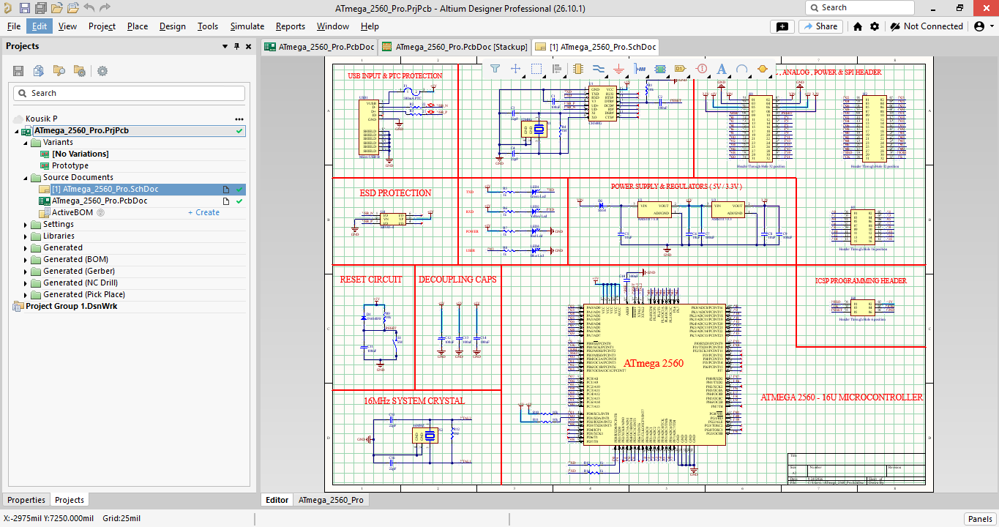
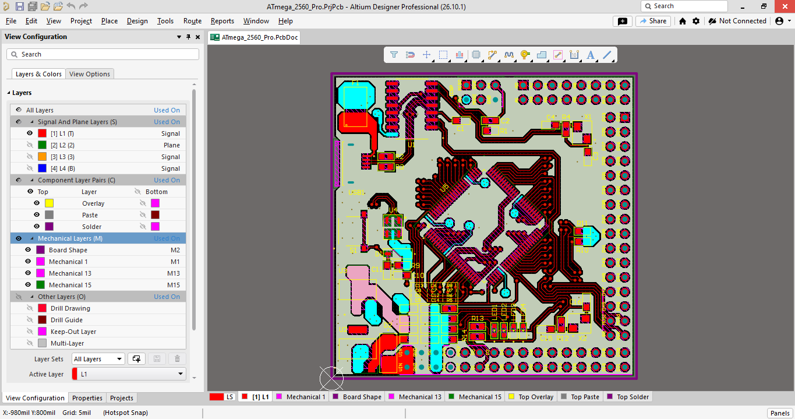
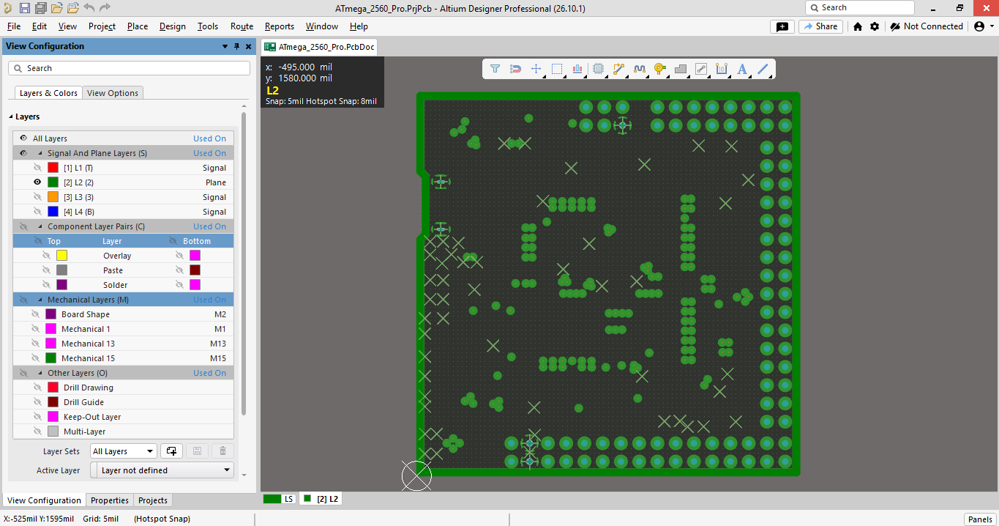
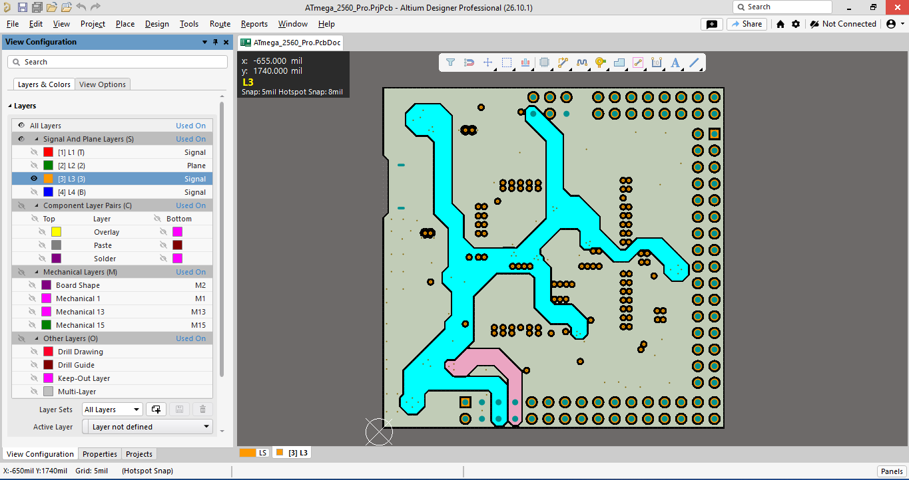
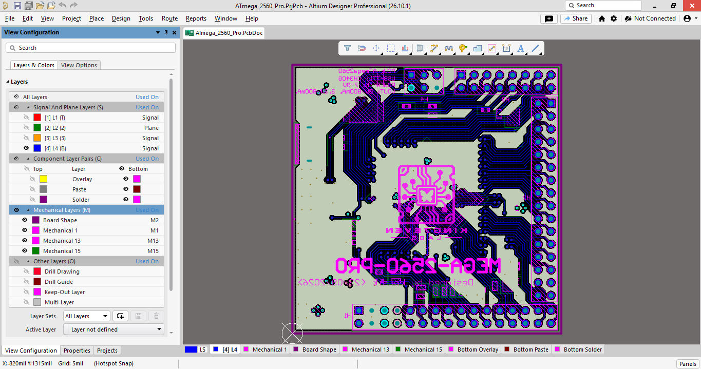

# ⚡ ATmega2560 Pro Hardware Board Design

## 📌 Project Overview

This project features a custom-designed **4-layer PCB layout** for the **ATmega2560 Pro** 8-bit AVR microcontroller, built from scratch in **Altium Designer**. By studying standard reference schematics, the design was completely re-engineered, optimized, and built in a compact square form factor with high-density component placement.

#### 🌟 Key Design Highlights
* **Centered Microcontroller Layout:** The **ATmega2560-16AU** IC is placed directly at the center of the PCB, allowing symmetrical trace routing and equal signal length distribution to surrounding I/O pin headers.
* **Custom 4-Layer Stackup (`Signal` - `GND` - `PWR` - `Signal`):** Engineered with dedicated internal Ground and Power planes to maximize noise immunity, reduce EMI, and ensure stable 16 MHz clock distribution.
* **USB High-Speed Routing:** USB D+/D- differential pairs routed with **90 Ω differential impedance control** for reliable serial communication.
* **Enhanced Protection Circuitry:** Integrated dedicated **ESD protection** on the USB differential lines for improved operational hardware reliability.
* **Dual Power Rail Architecture:** Features an **AMS1117-3.3V LDO regulator** alongside the **5V main rail** to power both 5V legacy modules and 3.3V sensors.
* **Complete Custom Libraries:** Designed custom schematic symbols, footprints, and integrated 3D STEP models for mechanical alignment.

---

## 🛠️ Key Specifications

| Parameter | Specification Details |
| :--- | :--- |
| **CAD Tool** | Altium Designer |
| **Microcontroller** | Microchip ATmega2560-16AU (8-bit AVR Architecture) |
| **Board Layers** | 4-Layer Stackup (`Top Signal` - `GND Plane` - `PWR Plane` - `Bottom Signal`) |
| **Target PCB Stackup** | JLCPCB JLC04161H-3313 (1.6mm Finished Thickness, Outer 1oz / Inner 0.5oz) |
| **Connector Type** | USB Type-C (USB 2.0 High-Speed) |
| **Circuit Protection** | Dedicated ESD Protection IC (USBLC6-2SC6 / SRV05-4) on USB Lines |
| **Impedance Control** | **90 Ω Differential Impedance** matched on USB D+/D- signal traces |
| **Form Factor** | Compact Square Layout with Centered MCU |
| **Clock Frequency** | 16 MHz External Crystal Oscillator |
| **Power Supply** | Dual Power Architecture (5V Main Bus + AMS1117-3.3V LDO Regulation) |
| **USB Bridge** | CH340G USB-to-UART Serial Converter |
| **Programming Headers**| Standard 2.54 mm Pitch Pin Headers & ICSP Header |
| **Library Assets** | Custom Schematic Symbols, IPC-Compliant PCB Footprints & 3D STEP Models |

---

## 📁 Repository Structure

```text
ATMEGA 2560 PRO PROJECTS/
├── 📁 3D/                                   # Component STEP models
├── 📁 Docs/                                 # Datasheets & Pinout reference files
├── 📁 Images/                               # Documentation screenshot assets
├── 📁 Libs/                                 # Custom library files
├── 📁 Project Logs for ATmega_2560_Pro/     # Altium ECO compilation & DRC logs
├── 📁 Project Outputs for ATmega_2560_Pro/  # Gerber, NC Drill, BOM & Assembly files
│
├── 📄 ATmega_2560_Pro.PcbDoc               # 4-Layer PCB Board Layout
├── 📄 ATmega_2560_Pro.SchDoc               # Circuit Schematic Document
├── 📄 ATmega_2560_Pro.PrjPcb               # Main Altium Project File
├── 📄 ATmega_2560_Pro.PrjPcbStructure      # Altium Project Metadata
├── 📄 Job.OutJob                           # Altium Output Job Configuration
├── 📄 PcbLib.PcbLib                        # Custom PCB Footprints Library
├── 📄 Schlib.SchLib                        # Custom Schematic Symbol Library
└── 📄 README.md                            # Project Documentation
```

---

## 📐 Design Files & Visual Previews

### 📄 1. Circuit Schematic (`ATmega_2560_Pro.SchDoc`)

Complete circuit schematic including ATmega2560-16AU microcontroller circuitry, CH340G USB-to-UART interface, dual power regulation, and ESD protection:



---

### 📁 2. 4-Layer PCB Board Stackup, Renders & Full Board View (`ATmega_2560_Pro.PcbDoc`)

Complete 4-layer routing layout, JLCPCB stackup configuration (JLC04161H-3313), impedance-matched differential traces (90 Ω), and 3D renderings.

#### PCB Layer Stackup (JLC04161H-3313)
* **Stackup Model:** JLCPCB 4-Layer Standard (JLC04161H-3313)
* **Controlled Impedance:** 90 Ω Differential Traces for USB 2.0 (D+ / D-)


#### Full Board Layout (All Layers Combined)
Preview of all signal layers and internal planes overlaid:


---

### 🖼️ 3D Board Views

| Top View (3D Render) | Bottom View (3D Render) |
| :---: | :---: |
|  |  |

---

### 🥞 2x2 PCB Layer Breakdown

| Layer 1 (Top Signal) | Layer 2 (GND Plane) |
| :---: | :---: |
|  |  |
| **Layer 3 (Power Plane)** | **Layer 4 (Bottom Signal)** |
|  |  |

---

### 📦 3. Custom Libraries & Project Files

* [`ATmega_2560_Pro.PrjPcb`](./ATmega_2560_Pro.PrjPcb) — Main Altium Designer Project file
* [`SchLib.SchLib`](./SchLib.SchLib) — Custom Schematic Symbol Library
* [`PcbLib.PcbLib`](./PcbLib.PcbLib) — Custom Component Footprint Library
* [`Job.OutJob`](./Job.OutJob) — Altium Manufacturing Output Job File

---

### 🏭 Output Files & Manufacturing Release

All fabrication and assembly outputs are generated via `Job.OutJob` for standard PCB manufacturing:

#### 📦 Output Files

* **[Gerber Files](./Project%20Outputs%20for%20ATmega_2560_Pro/Gerber/)**: Complete layer traces, silkscreen, solder mask, and paste layer outputs.
* **[NC Drill Files](./Project%20Outputs%20for%20ATmega_2560_Pro/NC%20Drill/)**: Plated (PTH) and non-plated (NPTH) hole coordinates and drill specifications.
* **[Pick & Place File (.txt , .csv)](./Project%20Outputs%20for%20ATmega_2560_Pro/Pick%20Place/)**: Component placement coordinates and orientations for automated SMT assembly.
* **[Bill of Materials (.xlsx )](./Project%20Outputs%20for%20ATmega_2560_Pro/BOM/)**: Comprehensive component list with designators, footprints, and manufacturer part numbers.
