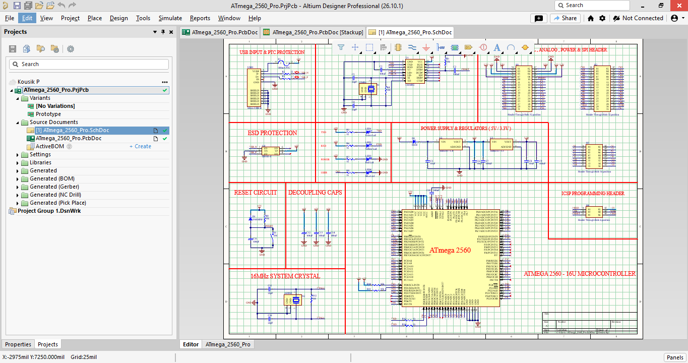
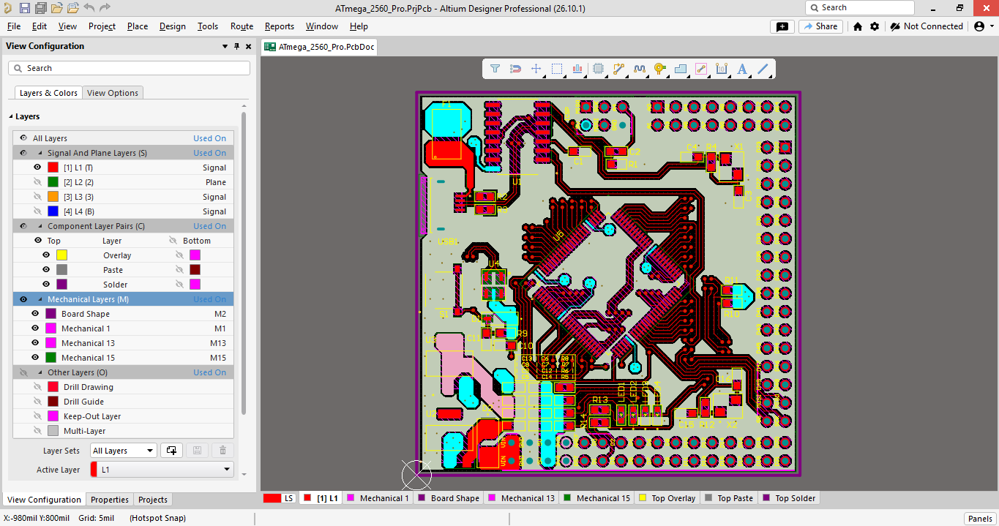
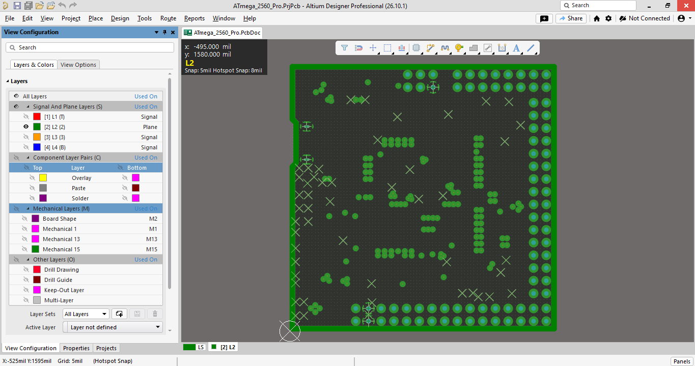
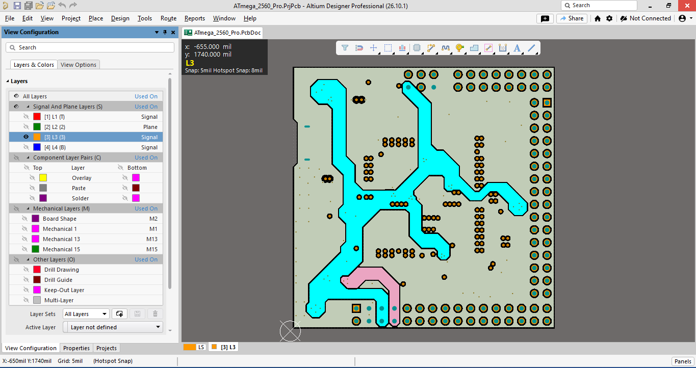
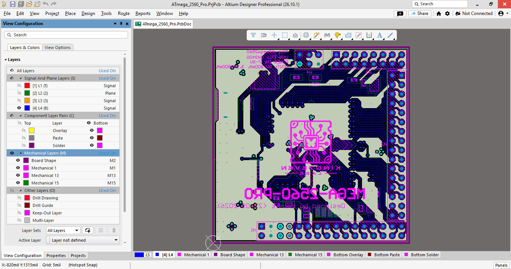

# ⚡ ATmega2560 Pro Hardware Board Design

## 📌 Project Overview

This project features a custom-designed **4-layer PCB layout** for the **ATmega2560 Pro** 8-bit AVR microcontroller, built from scratch in **Altium Designer**. By studying standard reference schematics, the design was completely re-engineered, optimized, and built in a compact square form factor with high-density component placement.

 ## 🌟 Key Features & Highlights

- **Centered Microcontroller Layout**: The ATmega2560-16AU IC is positioned directly at the center of the PCB, allowing symmetrical trace routing and uniform signal length distribution to all surrounding I/O pin headers.
- **Custom 4-Layer Stackup (Signal - GND - PWR - Signal)**: Engineered with dedicated internal Ground and Power planes to maximize noise immunity, reduce EMI, and ensure stable 16 MHz clock distribution.
- **USB-to-UART Interface**: Onboard CH340G converter paired with a precision 12 MHz external crystal and impedance-matched differential USB lines for reliable high-speed serial flashing.
- **Multi-Stage Hardware Protection**: 
  - Integrated **SRV05-4** TVS diode array for USB ESD line protection.
  - **500mA Resettable PTC Fuse** to guard against USB overcurrent conditions.
  - **SS14 Schottky Diode** for reverse-polarity voltage protection.
- **Dual LDO Power Delivery**: Onboard **AMS1117-5.0V** and **AMS1117-3.3V** linear regulators, supporting flexible input via VIN (7V–12V) or Micro-USB while supplying clean 5V and 3.3V rails for digital logic and external sensors.
- **Complete Peripheral Expansion**: Exposes core MCU GPIOs through dual 32-pin headers, a 16-pin analog header, and a standard 6-pin ICSP header for direct ISP bootloader programming.
- **Visual Status Feedback**: Equipped with 4 onboard 0603 SMD LEDs indicating **Power (Red)**, **User/D13 (Blue)**, **TX (Green)**, and **RX (Yellow)** states.
- **Custom CAD Library Assets**: Designed using 100% custom-built schematic symbols, PCB footprints, and integrated 3D STEP models for mechanical enclosure alignment.

---

## 🛠️ Key Specifications

| Parameter | Specification Details |
| :--- | :--- |
| **CAD Tool** | Altium Designer |
| **Microcontroller** | Microchip ATmega2560-16AU (8-bit AVR RISC, 256 KB Flash) |
| **Board Layers** | 4-Layer Stackup (`Top Signal` - `GND Plane` - `PWR Plane` - `Bottom Signal`) |
| **Target PCB Stackup** | JLCPCB JLC04161H-3313 (1.6mm Finished Thickness, Outer 1oz / Inner 0.5oz) |
| **Connector Type** | Micro-USB Type-B Female Connector (USB 2.0 Full-Speed) |
| **Circuit Protection** | SRV05-4 TVS ESD Protection + 500mA Resettable PTC Fuse + SS14 Diode |
| **Impedance Control** | **90 Ω Differential Impedance** matched on USB D+/D- signal traces |
| **Form Factor** | Compact Centered MCU Layout with Symmetrical I/O Breakouts |
| **Clock Frequency** | 16 MHz System Crystal + 12 MHz USB Clock Crystal |
| **Power Supply** | Dual LDO Regulation (AMS1117-5.0V & AMS1117-3.3V Rails) |
| **USB Bridge** | CH340G USB-to-UART Serial Converter |
| **Wireless / Extension** | External Wi-Fi / Bluetooth Module Interface Support (UART/SPI Headers) |
| **Programming Headers**| Standard 2.54 mm I/O Headers & Dedicated 6-Pin ICSP Header |
| **Library Assets** | Custom Schematic Symbols, IPC-Compliant Footprints & 3D STEP Models |

---

## 🧰 Primary Component List (ATmega2560 Pro)

| Category | Component Part Number | Description & Package |
| :--- | :--- | :--- |
| **Microcontroller** | ATmega2560-16AU | 8-bit AVR RISC MCU, 256KB Flash, 16MHz Clock (100-pin TQFP) |
| **USB Bridge** | CH340G | USB-to-UART Serial Converter IC (SOP-16) |
| **Voltage Regulators** | AMS1117-5.0 | 5V 1A Low Dropout Linear Voltage Regulator (SOT-223) |
| | AMS1117-3.3 | 3.3V 1A Low Dropout Linear Voltage Regulator (SOT-223) |
| **Crystals & Oscillators**| 7M-16.000MAAJ-T | 16 MHz Main System Crystal Oscillator (18pF, SMD 3225) |
| | 7M-12.000MAAJ-T | 12 MHz USB Clock Crystal Oscillator (18pF, SMD 3225) |
| **Circuit Protection** | SRV05-4MR6T1G | TVS Diode Array for USB D+/D- High-Speed ESD Line Protection (SOT-23-6) |
| | MF-MSMF050-2 | 500mA 15V Resettable PTC Fuse (1812 Surface Mount) |
| | SS14 | Schottky Barrier Diode 40V 1A Reverse Polarity Guard (SMA / DO-214AC) |
| | 1N4148W | Standard High-Speed Signal Diode 75V 250mA (SOD-123) |
| **Connectors & Interfaces**| 10118193-0001LF | Micro-USB Type-B Right-Angle Female Receptacle |
| | TSW-116-07-G-D | 2x32-Pin Double-Row Male Pin Headers (2.54mm Pitch) |
| | TSW-108-07-G-D | 2x16-Pin Double-Row Male Pin Header (2.54mm Pitch)[cite: 1] |
| | TSW-103-07-G-D | 2x3-Pin ICSP Programming & Flashing Header (2.54mm Pitch) |
| **Status LED Indicators** | 150060RS75000 | Red SMD LED (Power Indicator Rail, 0603 Package) |
| | 150060BS75000 | Blue SMD LED (User LED / D13 Pin, 0603 Package) |
| | 150060VS75000 | Green SMD LED (TX UART Active Line, 0603 Package) |
| | 150060YS75000 | Yellow SMD LED (RX UART Active Line, 0603 Package) |
| **Capacitors** | CC0603KRX7R9BB104 | 0.1µF (100nF) 50V X7R Decoupling Capacitors (0603 SMD) |
| | CC0603MRX5R6BB106 | 10µF 10V X5R Bulk Output Filter Capacitors (0603 SMD) |
| | CC0603JRNPO9BN220 | 22pF 50V C0G/NPO Crystal Load Capacitors (0603 SMD) |
| **Resistors** | RC0603FR-0722RL | 22Ω 1% Series Damping Resistors (USB D+/D- Lines, 0603 SMD) |
| | RC0603FR-071KL | 1kΩ 1% Current Limiting Resistors (LEDs, 0603 SMD) |
| | RC0603FR-0710KL | 10kΩ 1% Pull-Up Resistor (RESET Line, 0603 SMD) |
| | RC0603FR-071ML | 1MΩ 1% Parallel Feedback Resistor (Oscillator Circuit, 0603 SMD) |
| **Switches** | TS-1187A-B-A-B | Tactile Push Button Switch (SPST-NO, Reset Switch) |

---

## 📁 Repository Structure

```text
ATMEGA 2560 PRO PROJECTS/
├── 📁 3D/                                   # Component STEP models
├── 📁 Docs/                                 # Datasheets & Pinout reference files
├── 📁 Images/                               # Documentation screenshot assets
├── 📁 Libs/                                 # Custom library files
├── 📁 PDFs/                                 # Schematic & PCB Layout PDF exports
├── 📁 Project Logs for ATmega_2560_Pro/     # Altium ECO compilation & DRC logs
├── 📁 Project Outputs for ATmega_2560_Pro/  # Gerber, NC Drill, BOM & Assembly files
│
├── 📄 ATmega_2560_Pro.PcbDoc               # 4-Layer PCB Board Layout
├── 📄 ATmega_2560_Pro.SchDoc               # Circuit Schematic Document
├── 📄 ATmega_2560_Pro.PrjPcb               # Main Altium Project File
├── 📄 ATmega_2560_Pro.PrjPcbStructure      # Altium Project Metadata
├── 📄 Job.OutJob                           # Altium Output Job Configuration
├── 📄 PcbLib.PcbLib                        # Custom PCB Footprints Library
├── 📄 Schlib.SchLib                        # Custom Schematic Symbol Library
└── 📄 README.md                            # Project Documentation
```

---

## 📐 Design Files & Visual Previews

### 📄 1. Circuit Schematic (`ATmega_2560_Pro.SchDoc`)

Complete circuit schematic including ATmega2560-16AU microcontroller circuitry, CH340G USB-to-UART interface, dual power regulation, and ESD protection:



---

### 📁 2. 4-Layer PCB Board Stackup, Renders & Full Board View (`ATmega_2560_Pro.PcbDoc`)

Complete 4-layer routing layout, JLCPCB stackup configuration (JLC04161H-3313), impedance-matched differential traces (90 Ω), and 3D renderings.

#### PCB Layer Stackup (JLC04161H-3313)
* **Stackup Model:** JLCPCB 4-Layer Standard (JLC04161H-3313)
* **Controlled Impedance:** 90 Ω Differential Traces for USB 2.0 (D+ / D-)


#### Full Board Layout (All Layers Combined)
Preview of all signal layers and internal planes overlaid:


---

### 🖼️ 3D Board Views

| Top View (3D Render) | Bottom View (3D Render) |
| :---: | :---: |
|  |  |

---

### 🥞 2x2 PCB Layer Breakdown

| Layer 1 (Top Signal) | Layer 2 (GND Plane) |
| :---: | :---: |
|  |  |
| **Layer 3 (Power Plane)** | **Layer 4 (Bottom Signal)** |
|  |  |

---

### 📦 3. Custom Libraries & Project Files

| File Type | Description | File Link |
| :--- | :--- | :--- |
| **Project File** | Main Altium Designer Project file | [`ATmega_2560_Pro.PrjPcb`](./ATmega_2560_Pro.PrjPcb) |
| **Schematic Library** | Custom Schematic Symbol Library | [`SchLib.SchLib`](./SchLib.SchLib) |
| **PCB Library** | Custom Component Footprint Library | [`PcbLib.PcbLib`](./PcbLib.PcbLib) |
| **Output Job File** | Altium Manufacturing Output Job File | [`Job.OutJob`](./Job.OutJob) |

---

## 📄 Schematics & PCB Design Documents

| File Type | Description | Download Link |
| :--- | :--- | :--- |
| **Schematic PDF** | Full Schematic Circuit Diagram | [`Schematic.pdf`](./PDFs/Schematic.pdf) |
| **PCB Layout PDF** | Complete Board Layout & Layer Stackup | [`PCB_Layout.pdf`](./PDFs/Pcb_Layout.pdf) |

---

## 🏭 Output Files & Manufacturing Release

All fabrication and assembly outputs are generated via **[`Job.OutJob`](Job.OutJob)** for standard PCB manufacturing:

### 📦 Output Files

| Manufacturing File | Description | Download / Folder Link |
| :--- | :--- | :--- |
| **Gerber Files** | Complete layer traces, silkscreen, solder mask, and paste layer outputs. | [`Gerber Files`](./Project%20Outputs%20for%20ATmega_2560_Pro/Gerber/) |
| **NC Drill Files** | Plated (PTH) and non-plated (NPTH) hole coordinates and drill specifications. | [`NC Drill Files`](./Project%20Outputs%20for%20ATmega_2560_Pro/NC%20Drill/) |
| **Pick & Place File** | Component placement coordinates and orientations for automated SMT assembly (.txt , .csv). | [`Pick & Place File`](./Project%20Outputs%20for%20ATmega_2560_Pro/Pick%20Place/) |
| **Bill of Materials** | Comprehensive component list with designators, footprints, and manufacturer part numbers (.xlsx). | [`Bill of Materials (BOM)`](./Project%20Outputs%20for%20ATmega_2560_Pro/BOM/) |

---

## 🌐 Interactive 3D & Altium 365 Web Viewer

You can inspect the complete schematic, 4-layer PCB layout, and 3D component alignment directly in your web browser without installing Altium Designer:

👉 **[Launch Altium 365 Interactive 3D Viewer](https://kousik-p.365.altium.com/designs/C5D37B0A-66AF-48F0-AEC0-0A81A59421F1#design)**

### 🔍 Web Viewer Highlights
* **Interactive 3D Inspection:** Full 360° board rotation and component clearance check.
* **Cross-Probing:** Click any schematic net to highlight corresponding PCB traces.
* **Gerber & Layer Stackup:** Real-time inspection of L1–L4 stackup and manufacturing outputs.
* **BOM Manifest:** Live component list with footprint and designator tracking.

---

## 🎓 Acknowledgments & References

This hardware design is built using schematic references from the **RobotDyn ATmega2560 Pro** development layout, along with official hardware design guidelines provided by Microchip Technology and the open-source hardware community.

* **RobotDyn:** Reference design layout for the compact ATmega2560 Pro board architecture.
* **Microchip Technology Inc.:** Official ATmega2560 datasheet and AVR hardware design application notes.
* **Open Source Hardware Community:** Standard footprint libraries, Fritzing layout diagrams, and AVR board design best practices.

---

## 📚 Additional Resources

### 📄 Core Datasheets & Reference Material
* **[ATmega2560 Datasheet](Docs/atmel-2549-8-bit-avr-microcontroller_datasheet.pdf)** — Electrical characteristics, pin definitions, hardware registers, and peripheral specifications.

---

### 🛠️ Design Tools & Official Documentation
* **[Altium Designer Documentation](https://www.altium.com/documentation/altium-designer)** — Schematic capture, PCB rules, and manufacturing Output Job configuration setup.

---

## 👤 Author & Maintainer

<p align="center">
  <b>Designed & Engineered by Kousik P</b><br>
  <i>Hardware / PCB Design Engineer</i>
</p>

<p align="center">
  <a href="https://github.com/KING7EVEN-LABS"></a>
  <a href="https://www.linkedin.com/in/kousik-p-a99b4b283"></a>
  <a href="mailto:kousikings.eve.n7@gmail.com"></a>
</p>

---