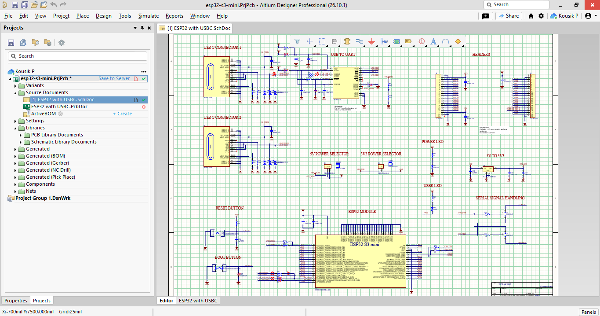
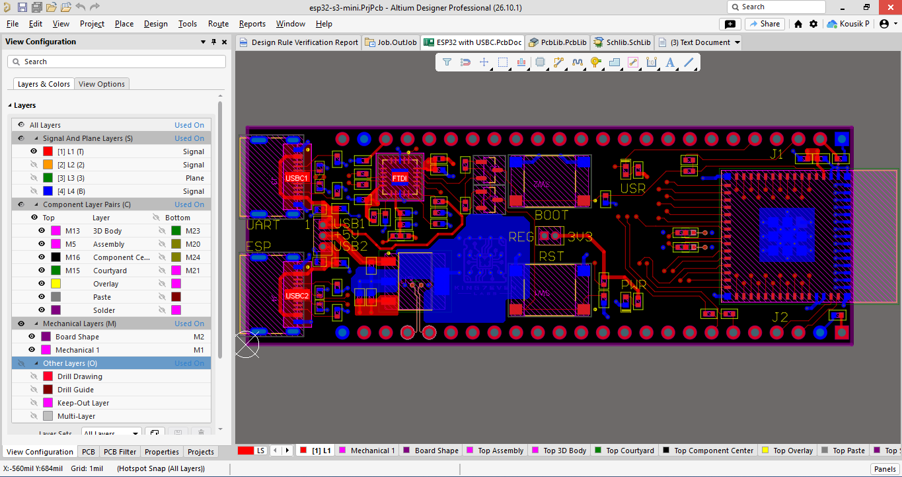
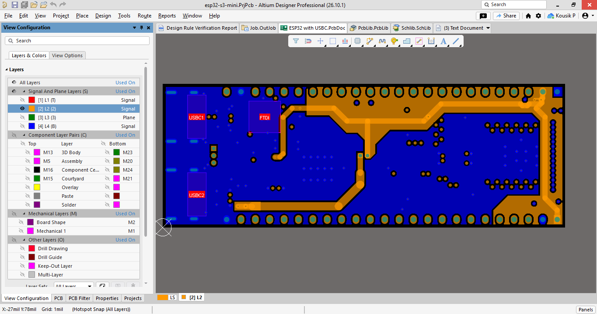
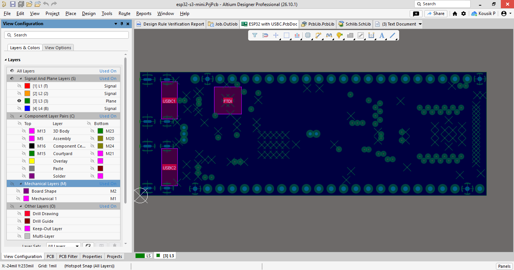
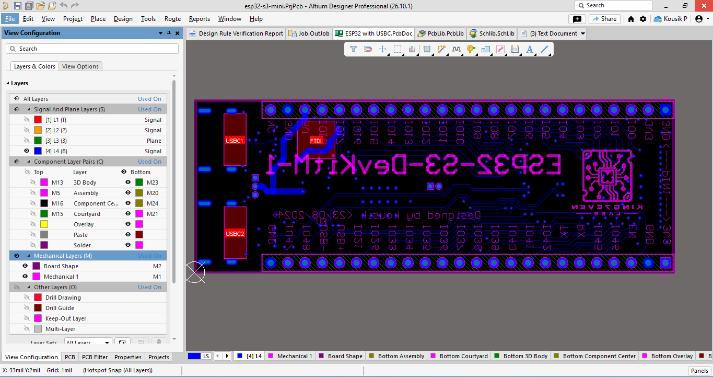

# ⚡ ESP32-S3 USB-C Hardware Board Design

## 📌 Project Overview

This project features a custom **4-layer PCB design** for the **ESP32-S3 Mini** microcontroller with a native **USB-C** interface, developed in **Altium Designer**. 

All schematic symbols, PCB footprints, stackup configurations, and 3D component models were built from scratch and assembled following design practices from **Robert Feranec's** hardware design tutorials.

---

## 🌟 Key Features & Highlights

- **Dual USB Architecture**:
  - **USB Port 1 (UART Bridge)**: Dedicated **FT231XQ-R** USB-to-UART bridge for programming, serial debugging, and automated flash flashing via DTR/RTS auto-reset logic.
  - **USB Port 2 (Native USB)**: Direct connection to ESP32-S3 Native USB (D+/D-) lines for USB OTG, USB CDC, and direct JTAG debugging.
- **Circuit Protection**: Integrated **AQ3045-01ETG** low-capacitance TVS diodes (5.3VWM, 12VC) on high-speed USB data lines and power rails for robust ESD protection.
- **Power Delivery**: High-current **TL1963A-33DCYR** (1.5A Low-Noise LDO) supplying stable 3.3V power during high RF transmit current spikes.
- **Power Selectors**: Flexible 3-pin headers with jumpers for independent 5V and 3V3 power domain selection.
- **User Interface & Controls**: On-board RESET and BOOT tactile switches with Status/User LEDs (Red and Yellow-Green 0402).
- **USB High-Speed / Differential Routing**: Controlled 90 Ω differential pair impedance routing on USB D+/D- traces with precise length matching for reliable data transmission.
- **Custom 4-Layer Stackup**: Engineered using a 4-layer PCB architecture (`Signal` - `Power` - `Ground` - `Signal`) for optimal power integrity, low noise, and minimal EMI.
- **Complete Custom Libraries**: Built with fully verified, custom-designed schematic symbols and PCB footprints for all components.
---

## 🛠️ Key Specifications

| Parameter | Specification Detail |
| :--- | :--- |
| **CAD Tool** | Altium Designer |
| **Microcontroller** | ESP32-S3-MINI-1-N8 (Xtensa® dual-core 32-bit LX7, up to 240 MHz) |
| **Wireless Connectivity** | 2.4 GHz Wi-Fi (802.11 b/g/n) + Bluetooth® 5 (LE / Mesh) |
| **Board Layers** | 4-Layer Board (`Signal` - `Power` - `Ground` - `Signal`) |
| **Target PCB Stackup** | JLCPCB JLC04161H-3313 standard stackup |
| **Connector Type** | 2x USB Type-C Receptacles (217179-0001, 24-Pin SMD RA) |
| **Circuit Protection** | Dedicated TVS Diodes (AQ3045-01ETG, 5.3VWM, 12VC SOD882) on USB lines |
| **Impedance Control** | 90 Ω Differential Pair Routing on USB D+/D- traces |
| **Form Factor** | Compact Dev Board with standard 2.54mm dual breakout headers |
| **Clock Frequency** | 240 MHz (MCU Core) / Integrated 40 MHz Crystal Oscillator |
| **Power Supply** | High-Current Low-Noise LDO (TL1963A-33DCYR, 5V to 3.3V @ 1.5A) |
| **USB Bridge** | FT231XQ-R (Full UART IC, 20QFN) |
| **Programming Headers** | 3-Pin Headers (FTS-103) with Shunts (M50-1920005) + Auto-Reset Logic (SS8050-G NPN) |
| **Library Assets** | Fully custom-built schematic symbols, PCB footprints, and integrated 3D STEP models for mechanical verification |

---

## 🧰 Primary Component List (ESP32-S3 Mini)

| Category | Component Part Number | Description & Package |
| :--- | :--- | :--- |
| **Microcontroller Module** | ESP32-S3-MINI-1-N8 | Dual-Core LX7 MCU, Wi-Fi/BLE 5.0, 8MB Flash (Surface Mount Module) |
| **USB-to-UART Bridge** | FT231XQ-R | Full-Speed USB to Full UART IC (20-QFN) |
| **Voltage Regulator** | TL1963A-33DCYR | 3.3V 1.5A Fast Transient-Response Low Dropout Regulator (SOT-223) |
| **Transistors & Switching** | SS8050-G | NPN Bipolar Transistor 25V 1.5A (Auto-Reset / Flashing Circuit, SOT-23) |
| **Circuit Protection** | AQ3045-01ETG | TVS ESD Diode 5.3V 12VC (SOD-882) |
| **Connectors & Headers** | 217179-0001 | USB 2.0 Type-C 24-Pin Female Receptacle (SMD / SMT) |
| | 22-28-4245 | 24-Pin Single-Row Vertical Pin Header (2.54mm Pitch) |
| | FTS-102-01-F-S | 2-Pin Single-Row Micro Header (1.27mm Pitch) |
| | FTS-103-01-F-S | 3-Pin Single-Row Micro Header (1.27mm Pitch) |
| | M50-1920005 | 1.27mm Pitch Jumper Shunt (Red) |
| **Status LED Indicators** | VLMS1500-GS08 | Red SMD LED (0402 Package) |
| | VLMG1500-GS08 | Yellow-Green SMD LED (0402 Package) |
| **Capacitors** | CL05B104KB54PNC | 0.1µF 50V X7R Ceramic Decoupling Capacitor (0402 SMD) |
| | CL05A105KL5NRNC | 1µF 35V X5R Ceramic Capacitor (0402 SMD) |
| | CL05A475MO5NUN | 4.7µF 16V X5R Ceramic Capacitor (0402 SMD) |
| | CL05A106MP8NUB8 | 10µF 10V X5R Ceramic Bulk Output Filter Capacitor (0402 SMD) |
| **Resistors** | RC0402JR-070RL | 0Ω Jumper Resistor (0402 SMD) |
| | RC0402FR-071KL | 1kΩ 1% Current Limiting Resistor (LEDs, 0402 SMD) |
| | RC0402FR-074K7L | 4.7kΩ 1% Resistor (0402 SMD) |
| | RC0402FR-0727RL | 27Ω 1% Series Damping Resistor (USB Native D+/D- Lines, 0402 SMD) |
| | AC0402FR-075K1L | 5.1kΩ 1% Automotive Resistor (USB Type-C CC1/CC2 Pull-down, 0402 SMD) |
| | AC0402FR-0710KL | 10kΩ 1% Automotive Resistor (EN / Boot Pull-up, 0402 SMD) |
| **Switches** | PTS645SH50SMTR92 | Tactile Push Button Switch (SPST-NO, EN / Boot Mode Switches) |

---

## 📁 Repository Structure

```text
ESP32_S3_USBC/
│
├── 📁 3D/                                     # Component STEP models
├── 📁 Docs/                                   # Datasheets & Pinout reference files
├── 📁 Image/                                  # 3D Renders, Schematics & Layer screenshots
├── 📁 Libs/                                   # Library files
├── 📁 PDFs/                                   # Schematic & PCB Layout PDF exports
├── 📁 Project Logs for esp32-s3-mini/        # Altium ECO compilation logs
├── 📁 Project Outputs for esp32-s3-mini/     # Gerber, BOM & DRC Reports
│
├── 📄 ESP32 with USBC.PcbDoc                 # 4-Layer PCB Board Layout
├── 📄 ESP32 with USBC.SchDoc                 # Circuit Schematic Document
├── 📄 Job.OutJob                             # Altium Output Job Configuration
├── 📄 PcbLib.PcbLib                          # Custom PCB Footprint Library
├── 📄 Schlib.SchLib                          # Custom Schematic Symbol Library
├── 📄 esp32-s3-mini.PrjPcb                   # Main Altium Project File
├── 📄 esp32-s3-mini.PrjPcbStructure          # Altium Project Metadata
└── 📄 README.md                              # Project Documentation
```

---

## 📐 Design Files & Visual Previews

### 📄 1. Circuit Schematic (`ESP32 with USBC.SchDoc`)
Complete circuit schematic including ESP32-S3 microcontroller circuitry, USB-C interface, power regulation, and ESD protection:



---

### 📁 2. 4-Layer PCB Board Stackup, Renders & Full Board View (`ESP32 with USBC.PcbDoc`)
Complete 4-layer routing layout, JLCPCB stackup configuration (JLC04161H-3313), impedance-matched differential traces ($90\,\Omega$), and 3D renderings.

#### PCB Layer Stackup (JLC04161H-3313)
* **Stackup Model:** JLCPCB 4-Layer Standard (JLC04161H-3313)
* **Controlled Impedance:** $90\,\Omega$ Differential Traces for USB 2.0 ($D+/D-$)


#### Full Board Layout (All Layers Combined)
Preview of all signal layers and internal planes overlaid:


### 🖼️ 3D Board Views
| Top View (3D Render) | Bottom View (3D Render) |
| :---: | :---: |
|  |  |

### 🥞 2x2 PCB Layer Breakdown
| Layer 1 (Top Signal) | Layer 2 (GND Plane) |
| :---: | :---: |
|  |  |
| **Layer 3 (Power Plane)** | **Layer 4 (Bottom Signal)** |
|  |  |

---

### 📦 3. Custom Libraries & Project Files

| File Type | Description | File Link |
| :--- | :--- | :--- |
| **Project File** | Main Altium Designer Project file | [`esp32-s3-mini.PrjPcb`](esp32-s3-mini.PrjPcb) |
| **Schematic Library** | Custom Schematic Symbol Library | [`Schlib.SchLib`](SchLib.SchLib) |
| **PCB Library** | Custom Component Footprint Library | [`PcbLib.PcbLib`](PcbLib.PcbLib) |
| **Output Job File** | Altium Manufacturing Output Job File | [`Job.OutJob`](Job.OutJob) |

---

## 📄 Schematics & PCB Design Documents

| File Type | Description | Download Link |
| :--- | :--- | :--- |
| **Schematic PDF** | Full Schematic Circuit Diagram | [`Schematic.pdf`](./PDFs/Schematic.pdf) |
| **PCB Layout PDF** | Complete Board Layout & Layer Stackup | [`PCB_Layout.pdf`](./PDFs/Pcb_Layout.pdf) |

---

## 🏭 Output Files & Manufacturing Release

All fabrication and assembly outputs are generated via **[`Job.OutJob`](Job.OutJob)** for standard PCB manufacturing:

### 📦 Output Files

| Manufacturing File | Description | Download / Folder Link |
| :--- | :--- | :--- |
| **Gerber Files** | Complete layer traces, silkscreen, solder mask, and paste layer outputs. | [`Gerber Files`](Project%20Outputs%20for%20esp32-s3-mini/Gerber/) |
| **NC Drill Files** | Plated (PTH) and non-plated (NPTH) hole coordinates and drill specifications. | [`NC Drill Files`](Project%20Outputs%20for%20esp32-s3-mini/NC%20Drill) |
| **Pick & Place File** | Component placement coordinates and orientations for automated SMT assembly. | [`Pick & Place File`](Project%20Outputs%20for%20esp32-s3-mini/Pick%20Place) |
| **Bill of Materials** | Comprehensive component list with designators, footprints, and manufacturer part numbers. | [`Bill of Materials (BOM)`](Project%20Outputs%20for%20esp32-s3-mini/BOM) |

---

## 🌐 Interactive 3D & Altium 365 Web Viewer

You can inspect the complete schematic, 4-layer PCB layout, and 3D component alignment directly in your web browser without installing Altium Designer:

👉 **[Launch Altium 365 Interactive 3D Viewer](https://kousik-p.365.altium.com/designs/04C48C61-3AA3-4A92-8D82-03B07C9C1723)**

### 🔍 Web Viewer Highlights
* **Interactive 3D Inspection:** Full 360° board rotation and component clearance check.
* **Cross-Probing:** Click any schematic net to highlight corresponding PCB traces.
* **Gerber & Layer Stackup:** Real-time inspection of L1–L4 stackup and manufacturing outputs.
* **BOM Manifest:** Live component list with footprint and designator tracking.

---

## 🎓 Acknowledgments & References

This hardware design was created by following the expert hardware engineering tutorials provided by **Robert Feranec**. 

* **Instructor:** Robert Feranec (Hardware Design Engineer & Educator)
* **YouTube Channel:** [FEDEVEL Educational / Robert Feranec](https://www.youtube.com/watch?v=KWIzhbQaZZk)
* **Topics Covered:** Altium Designer workflows, 4-layer PCB stackup planning, custom component footprint creation, and USB differential pair routing.

## 📚 Additional Resources

### 📄 Core Datasheets & Reference Material
* **[ESP32-S3-MINI-1 Datasheet](Docs/esp32-s3-mini-1_mini-1u_datasheet_en.pdf)** — Hardware specifications, RF layout guidelines, and pinout definitions.
* **[ESP32 Pinout Matrix](Docs/ESP32%20pinout%20sheet.xlsx)** — Detailed GPIO multiplexing and peripheral mapping reference.
* **[Design & Material Notes](Docs/material_note.xlsx)** — Component selection parameters, stackup constraints, and BOM notes.

---

### 🛠️ Design Tools & Official Documentation
* **[Altium Designer Documentation](https://www.altium.com/documentation/altium-designer)** — Official guides for schematic capture, PCB layout, and Output Job generation.

---

---

## 👤 Author & Maintainer

<p align="center">
  <b>Designed & Engineered by Kousik P</b><br>
  <i>Hardware / PCB Design Engineer</i>
</p>

<p align="center">
  <a href="https://github.com/KING7EVEN-LABS"></a>
  <a href="https://www.linkedin.com/in/kousik-p-a99b4b283"></a>
  <a href="mailto:kousikings.eve.n7@gmail.com"></a>
</p>
